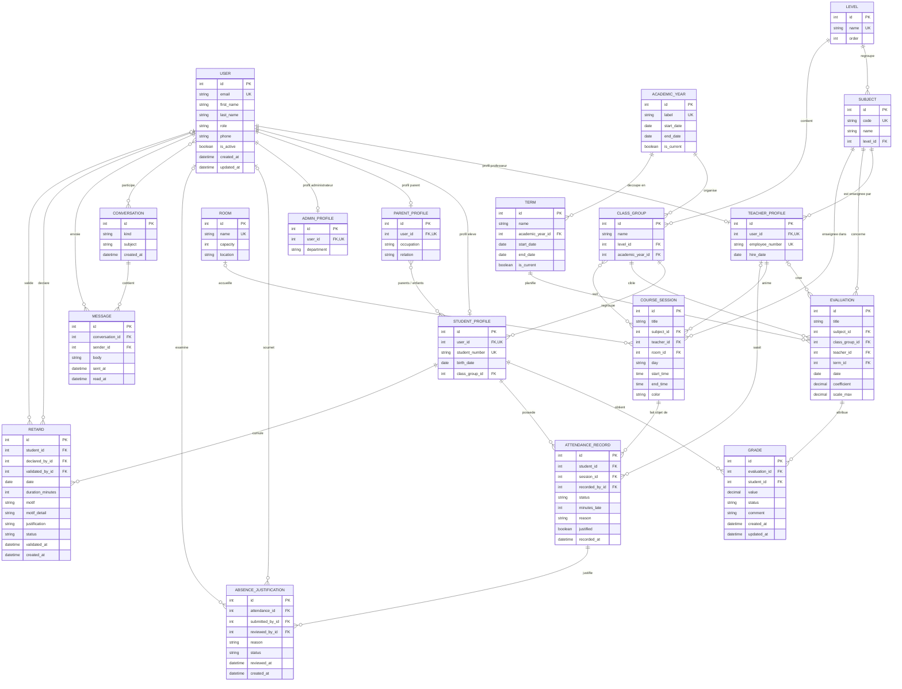

# Projet Ag PP2 - Espace Scolaire

## Vue d'ensemble

**Ag PP2** est une application web Django pour gérer un établissement scolaire (primaire à supérieur). L'authentification se fait par **email** et chaque utilisateur possède un **rôle** (`ADMIN`, `TEACHER`, `STUDENT`, `PARENT`) qui conditionne l'accès aux différentes rubriques.

Le projet est à l'**étape 5** : emploi du temps hebdomadaire universel + saisie de notes façon tableur.

---

## Arborescence du projet

```
ag_pp2/
├── config/                # Réglages Django (settings, urls racine, wsgi/asgi)
├── users/                 # Authentification, rôles, profils 1-1 (User + Role + Teacher/Student/Parent/AdminProfile)
├── academics/             # Année, niveaux, classes, matières, évaluations, notes
├── schedule/              # Salles + séances hebdomadaires (étape 5)
├── attendance/            # Appels (FK vers CourseSession)
├── messaging/             # Messagerie interne
├── vie_scolaire/          # Retards, motifs, validation
├── templates/             # Templates HTML globaux
│   ├── base.html
│   ├── academics/         # Listes, création, saisie d'évaluations
│   ├── schedule/          # Grille hebdomadaire
│   ├── attendance/        # Saisie et suivi des appels
│   ├── messaging/         # Conversations et messages
│   └── users/             # Dashboards + login par rôle
│       ├── dashboard_admin.html
│       ├── dashboard_parent.html
│       ├── dashboard_student.html
│       └── dashboard_teacher.html
├── static/                # (réservé aux assets statiques futurs)
├── manage.py
├── run_dev.bat            # Lance le serveur sur 127.0.0.1:8123
├── requirements.txt
├── db.sqlite3             # Base de données SQLite locale
└── ADEMI_MEMORY.md        # Mémoire de contexte pour les runs Ademi
```

### Rôle de chaque app

| App | Rôle |
|-----|------|
| `users` | Modèle `User` (email = identifiant), `Role`, profils 1-1 (`StudentProfile`, `TeacherProfile`, `ParentProfile`, `AdminProfile`). Gère login/logout/redirect par rôle. |
| `academics` | Référentiels (AcademicYear, Level, Subject, ClassGroup, Term) + évaluations + notes. Calcule moyennes simples et pondérées. |
| `schedule` | Salles et séances hebdomadaires (Room, CourseSession). Vue hebdomadaire adaptée au rôle. |
| `attendance` | Appels : une `AttendanceRecord` par (élève, séance). FK vers `schedule.CourseSession`. |
| `messaging` | Fils de discussion / annonces internes. |
| `vie_scolaire` | Gestion des retards (motif, durée, validation par la vie scolaire). |

---

## Plan de Base de Données (BDD)

### 1. Utilisateurs (`users`)

| Modèle | Description | Clés principales |
|--------|-------------|------------------|
| **User** (AUTH_USER_MODEL) | Utilisateur principal (email = identifiant) | `email` (unique), `first_name`, `last_name`, `role`, `phone`, `is_active`, `created_at`, `updated_at` |
| **Role** | Choix de rôle | `ADMIN`, `TEACHER`, `STUDENT`, `PARENT` |
| **TeacherProfile** | Profil professeur (1:1 avec User TEACHER) | `user` (OneToOne), `employee_number`, `subjects` (ManyToMany), `hire_date` |
| **StudentProfile** | Profil élève (1:1 avec User STUDENT) | `user` (OneToOne), `student_number`, `birth_date`, `class_group` (FK), `parents` (ManyToMany) |
| **ParentProfile** | Profil parent (1:1 avec User PARENT) | `user` (OneToOne), `occupation`, `relation` (Mère/Father/Tuteur/Lautre) |
| **AdminProfile** | Profil administrateur (1:1 avec User ADMIN) | `user` (OneToOne), `department`, `is_superuser` |

### 2. Académique (`academics`)

| Modèle | Description | Clés principales |
|--------|-------------|------------------|
| **AcademicYear** | Année scolaire | `label`, `start_date`, `end_date`, `is_current` |
| **Level** | Niveau scolaire (6ème, 5ème, etc.) | `name`, `order` |
| **Subject** | Matière enseignée | `code`, `name`, `level` (ForeignKey) |
| **ClassGroup** | Classe (ex: 6ème A) | `name`, `level`, `academic_year`, `unique_together=(name, level, academic_year)` |
| **Term** | Trimestre / période | `name`, `academic_year`, `start_date`, `end_date`, `is_current` |
| **Evaluation** | Épreuve notée | `title`, `subject`, `class_group`, `teacher` (FK optional), `term`, `date`, `coefficient`, `scale_max`, `created_at`, `updated_at` |
| **Grade** | Note d'un élève | `student` (FK vers StudentProfile), `evaluation`, `value`, `status` (PRESENT/ABSENT/DISPENSED/NOT_SUBMITTED), `comment`, `created_at`, `updated_at` |

### 3. Planning (`schedule`)

| Modèle | Description | Clés principales |
|--------|-------------|------------------|
| **Room** | Salle physique | `name` (unique), `capacity`, `location` |
| **CourseSession** | Séance hebdomadaire | `day` (LUN/MAR/WED/THU/FRI/SAT), `title`, `class_groups` (ManyToMany), `subject`, `teacher`, `room` (FK optional), `start_time`, `end_time`, `color` (classe Tailwind) |

### 4. Présence (`attendance`)

| Modèle | Description | Clés principales |
|--------|-------------|------------------|
| **AttendanceRecord** | Feuille de présence (élève × séance) | `student` (FK), `session` (FK), `status` (PRESENT/LATE/ABSENT/EXCUSED), `minutes_late`, `reason`, `justified`, `recorded_at`, `recorded_by` (FK) |
| **AbsenceJustification** | Justification d'absence | `attendance` (FK), `submitted_by` (FK), `reason`, `status` (PENDING/APPROVED/REJECTED), `reviewed_by`, `reviewed_at`, `created_at` |

### 5. Messagerie (`messaging`)

| Modèle | Description | Clés principales |
|--------|-------------|------------------|
| **Conversation** | Groupe de discussion | `kind` (MAIL/CHAT), `participants` (ManyToMany), `subject` (optionnel), `created_at` |
| **Message** | Message dans une conversation | `sender` (FK), `body`, `sent_at`, `read_at` |

### 6. Vie scolaire (`vie_scolaire`)

| Modèle | Description | Clés principales |
|--------|-------------|------------------|
| **RetardMotif** | Motif type de retard | `TRANSPORT`, `FAMILIAL`, `MEDICAL`, `ADMINISTRATIF`, `AUTRE` |
| **RetardStatus** | État de validation d'un retard | `PENDING`, `JUSTIFIED`, `UNJUSTIFIED` |
| **Retard** | Un retard déclaré | `student`, `date`, `duration_minutes`, `motif`, `motif_detail`, `justification`, `status`, `declared_by`, `validated_by`, `validated_at`, `created_at` |

### Relations principales

- **User** ↔ **Role** (choix)
- **User** ↔ **TeacherProfile** (1:1, role=TEACHER)
- **User** ↔ **StudentProfile** (1:1, role=STUDENT)
- **User** ↔ **ParentProfile** (1:1, role=PARENT)
- **TeacherProfile** ↔ **CourseSession** (1:N)
- **StudentProfile** ↔ **ClassGroup** (1:N)
- **TeacherProfile** ↔ **StudentProfile** via `parents` (ManyToMany)
- **CourseSession** ↔ **AttendanceRecord** (1:N)
- **AttendanceRecord** ↔ **AbsenceJustification** (1:N)
- **CourseSession** ↔ **Room** (optionnel)
- **CourseSession** ↔ **Subject** (ForeignKey)
- **Evaluation** ↔ **Grade** (1:N)
- **Evaluation** ↔ **CourseSession** (1:N) — via `subject` et `class_group`
- **Grade** ↔ **User** (via `StudentProfile.user`)
- **Retard** ↔ **StudentProfile** (FK)
- **Retard** ↔ **User** (FK declared_by / validated_by)

### 7. Base de données actuelle

- 5 migrations initiales dans `users/migrations/`
- Migrations dans chaque app : `academics`, `schedule`, `attendance`, `messaging`, `vie_scolaire`
- Base de données **SQLite** (`db.sqlite3`) prête
- Commande `seed_db` disponible pour réinitialiser la base de démo

### Étapes restantes (roadmap)

1. **Étape 6** – Appels (Attendance) – Implémenter la saisie des présences
2. **Étape 7** – Messagerie interne – Compléter le système de discussions
3. **Étape 8** – Intégration complète et tests

### Comptes de test

Tous les comptes utilisent le mot de passe **`password123`**.

| Rôle | Email | Accès |
|------|-------|-------|
| Admin | `admin@test.com` | Tout, dont filtres sur l'emploi du temps + admin Django |
| Professeur | `prof1@test.com` | Ses séances, ses évaluations, saisie des notes |
| Élève | `eleve1@test.com` | EDT de sa classe (`6ème A`), ses notes |
| Parent | `parent1@test.com` | Notes de ses enfants |

L'admin Django (`/admin/`) est accessible avec n'importe quel compte `is_staff=True`.

